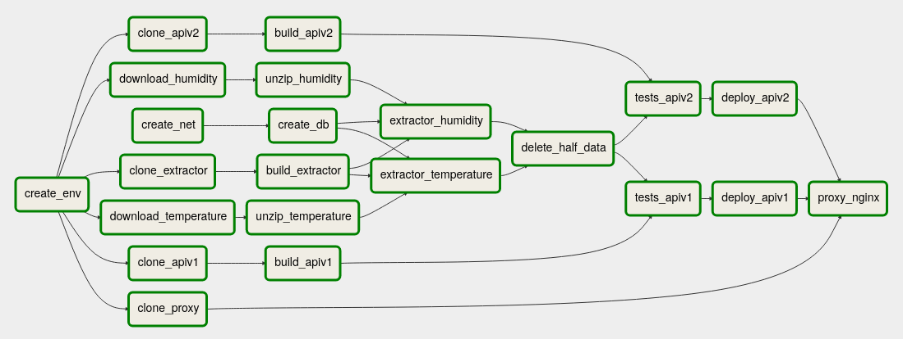

# Introducción
En esta práctica se ha procedido a crear un despliegue automático bajo la filosofía de Cloud Native desplegando microservicios de manera automática. Dichos microservicios se tienen que integrar de forma continua, por lo que, antes de proceder a su despliegue, se testean.

En esta práctica en concreto se ha procedido a recopilar datos de Internet, tratar y almacenar dichos datos; y, por otro lado, desplegar dos versiones de servicios que manejan dichos datos. Para ello ha hecho uso de la herramienta [Airflow](https://airflow.apache.org/) de Apache.

# Flujo de trabajo
El flujo de trabajo que se ha definido ha sido:

Dicho flujo de trabajo se encuentra en el [repositorio](https://github.com/kcobos/CC2-Airflow/blob/master/dagp2.py).

## Detalle de las tareas
Todas las tareas de este flujo son en Bash. Recorriendo el flujo de trabajo, se van a detallar las tareas que lo componen y para qué sirven:

### create_env
En esta tarea se crea una carpeta temporal en la que clonar los distintos repositorios así como los datos que se van a tratar. Si existe la carpeta, se deja tal cual.

### create_net
Se necesita crear una red, comprobando si ya existe, en *Docker* para no tener que publicar siempre los puertos. Creando esta red, la base de datos no estaría expuesta al exterior con lo que se gana en seguridad.

### download_temperature y download_humidity
Ambas son dos tareas de bash para hacer uso del programa *wget* para descargar los datasets.

### clone_extractor
Se ha creado una aplicación dentro de un contenedor el cual lee el archivo pasado por variable de entorno, parsea el archivo en busca de la columna solicitada en otra variable de entorno y añade sus datos a la base de datos InfluxDB.

En esta tarea se clona el repositorio de este servicio que se encuentra en [https://github.com/kcobos/CC2-Airflow/tree/extractor](https://github.com/kcobos/CC2-Airflow/tree/extractor), que es la rama *extractor* del repositorio [https://github.com/kcobos/CC2-Airflow/](https://github.com/kcobos/CC2-Airflow/tree/extractor). Dicha rama se clona en la carpeta temporal del proyecto.

### clone_apiv1
Se ha creado la primera versión de la API a partir del [ejemplo del profesor](https://github.com/manuparra/MaterialCC2020/blob/master/exampleARIMA_temperature.py) usando ARIMA para predecir los datos.

En esta tarea se clona el repositorio de este servicio que se encuentra en [https://github.com/kcobos/CC2-Airflow/tree/apiv1](https://github.com/kcobos/CC2-Airflow/tree/apiv1), que es la rama *apiv1* del repositorio [https://github.com/kcobos/CC2-Airflow/](https://github.com/kcobos/CC2-Airflow/tree/apiv1). Dicha rama se clona en la carpeta temporal del proyecto.

### clone_apiv2
Se ha creado la segunda versión de la API usando la API de [OpenWeather](https://openweathermap.org/). Dicha API en usuario gratuitos no comparte la información hora por hora, sino cada tres horas. Este es el motivo por el que desde esta versión de la API se extrae menos información. 

En esta tarea se clona el repositorio de este servicio que se encuentra en [https://github.com/kcobos/CC2-Airflow/tree/apiv2](https://github.com/kcobos/CC2-Airflow/tree/apiv2), que es la rama *apiv2* del repositorio [https://github.com/kcobos/CC2-Airflow/](https://github.com/kcobos/CC2-Airflow/tree/apiv2). Dicha rama se clona en la carpeta temporal del proyecto.

### clone_proxy
Después de incluir los dos micriservicios en diferentes puertos, he tratado de usar *nginx* como proxy para acceder a ambos microservicios bajo un mismo puerto en diferentes rutas. 

En esta tarea se clona el repositorio de este servicio que se encuentra en [https://github.com/kcobos/CC2-Airflow/tree/proxy](https://github.com/kcobos/CC2-Airflow/tree/proxy), que es la rama *proxy* del repositorio [https://github.com/kcobos/CC2-Airflow/](https://github.com/kcobos/CC2-Airflow/tree/proxy). Dicha rama se clona en la carpeta temporal del proyecto.

### create_db
Se crea un contenedor para la base de datos en la red previamente creada. Si ya existe el contenedor, no se vuelve a crear otro. He escogido InfluxDB como motor de la base de datos debido a que los datos son temporales y este motor de base de datos ofrece utilidades para este tipo de datos haciendo que su tratamiento sea más fácil.

### unzip_temperature y unzip_humidity
Al igual que las anteriores, se una bash para realizar la descompresión de los archivos descargados previamente con el programa *unzip* sobrescribiendo la información que pudiese haber ya descomprimida de otras ejecuciones.

### build_extractor, build_apiv1 y build_apiv2
Se crean las distintas imágenes de las aplicaciones para su posterior uso.

### extractor_humidity y extractor_temperature
Se hace uso de la aplicación *extractor* con diferentes parámetros para tratar los ficheros temperature.csv y humidity.csv ubicados en la carpeta temporal y almacenar la información en la base de datos. Como se ha comentado, esta aplicación ubicada en un contenedor recibe como variables de entorno el fichero y la columna a tratar. Dichos ficheros se montan en un volumen. 

Al estar esta aplicación en un contenedor puede acceder a la base de datos siempre que esté en su red.

### delete_half_data
Esta tarea es necesaria realizarla desde otro contenedor que esté conectado a la red creada. En ella se eliminan los datos anteriores a 2015 quedándonos con la mitad de los mismos para que los modelos se calculen un poco más rápido.

Al haber usado InfluxDB la consulta para eliminar los datos se puede realizar usando *curl*.

### tests_apiv1 y tests_apiv2
Se realizan los test de ambas versiones de la API en sus propios contenedores sobrescribiendo la aplicación que se lanza por defecto, que sería el servidor, por el programa de testeo. De esta manera se puede estar seguro de que el contenedor funciona correctamente cumpliendo con sus objetivos.

### deploy_apiv1 y deploy_apiv2
Se ponen a producción ambas APIs de forma independiente. Se han añadido también a la red *bridge* para poder tener acceso a ellas, exponiendo un puerto diferente.

### proxy_nginx
Se ha tratado de poner un proxy por arriba de las APIs para acceder a cada una desde el mismo puerto y con diferentes rutas pero no he sido capaz de configurarlo correctamente.